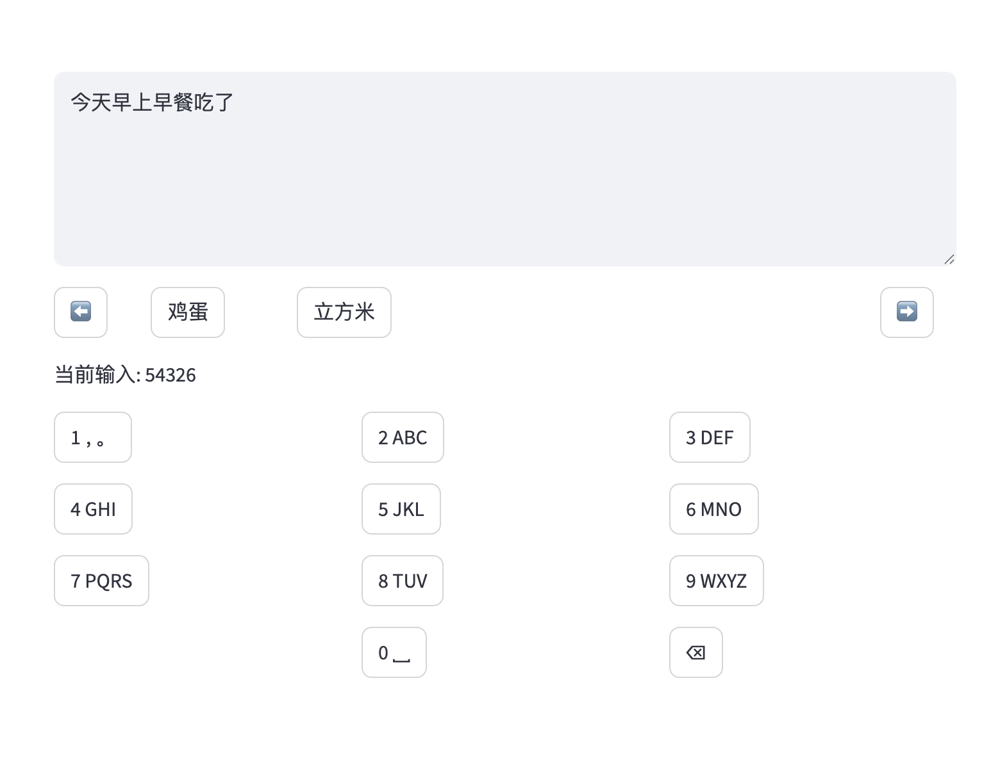

# zhn_T9_model
This is a **Streamlit-based web demo** for a Chinese **T9 (九键) predictive input method**. It simulates the classic mobile keypad input experience with real-time character prediction based on the current input context and numeric key codes.

## How to run
In terminal:

```
pip install -r requirements.txt
streamlit run interface/demo.py   
```

## Application of the model
Call the model directly from the pipeline.
```python
async def input_predict(text:str) -> list[str]:
    pipe = Pipeline()
    candidats = pipe.predict(text)
    return candidats
```

## Example Use Case
The content of the text box above can be freely edited.
The currently entered T9 code and predictions based on context and code are displayed below.
The 1 key is used to enter punctuation marks, which are not considered here.



